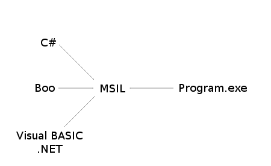

Starting out
============

Overview
--------

Boo is an amazing language that combines the syntactic sugar of
`Python`_, the features of `Ruby`_, and the speed and safety of `C#`_.

Like C#, Boo is a statically-typed language, which means that types are
important. This adds a degree of safety that Python and other
dynamically-typed languages do not currently provide.

It fakes being a dynamically-typed language by inference. This makes it
seem much like Python’s simple and programmer-friendly syntax.

CSharp
~~~~~~

::

    int i = 0;
    MyClass m = new MyClass();

Boo
~~~

::

    i = 0
    m = MyClass()

Hello, World!
-------------

A `Hello, World!`_ program is very simple in Boo.

Don’t worry if you don’t understand it, I’ll go through it one step at a
time.

helloworld.boo
~~~~~~~~~~~~~~
::

    print "Hello, World!"
    //    OR
    print("Hello, World!")

Output
~~~~~~
::

    Hello, World!
    Hello, World!

1. First, you must compile the helloworld.boo file to an executable.
2. Open up a new command line
3. ``cd`` into the directory where you placed the ``helloworld.boo``
   file.
4. ``booc helloworld.boo`` (this assumes that Boo is installed and in
   your system path)
5. ``helloworld.exe``
6. If you are using `Mono`_, ``mono helloworld.exe``
7. Using the print macro, it prints the string “Hello, World!” to the
   screen. OR
8. Using the print function, it prints the string “Hello, World!” to the
   screen.

Now these both in the end, do the same thing. They both call
``System.Console.WriteLine("Hello, World")`` from the .NET Standard
Library.

And it’s that simple.

.. note:: Using the macro version ``print "Hello, World!"`` is recommended.

Comparing code between Boo, C#, and VB.NET
------------------------------------------

Now you may be wondering how Boo could be as fast as C# or VB.NET.

Using their Hello World programs, I’ll show you.

Boo
~~~
::

    print "Hello World!"

    // Output: Hello World!

CSharp
~~~~~~
::

    public class Hello
    {
      public static void Main()
      {
        System.Console.WriteLine("Hello World!");
      }
    }

    // Output: Hello World!

VB.NET
~~~~~~
::

    Public Class Hello
      Public Shared Sub Main()
        System.Console.WriteLine("Hello World!")
      End Sub
    End Class

    ' Output: Hello World!

All three have the same end result and all three are run in the .NET
Framework.

All three are first translated into MSIL, then into executable files.

   MSIL Diagram

If you were to take the executables created by their compilers, and
disassemble them with ildasm.exe, you would see a very similar end
result, which means that the executables themselves are very similar, so
the speed between C# and Boo is practically the same, it just takes less
time to write the Boo code.

Booish
------

``booish`` is a command line utility that provides a realtime
environment to code boo in. It is great for testing purposes, and I
recommend following along for the next few pages by trying out a few
things in ``booish``. You can invoke it by loading up a terminal, then
typing booish (this assumes that Boo is installed and in your system
path), or by double-clicking the booish icon. In ``booish``, you can up
arrow to re-enter (with editing) a previously entered line. Here’s what
``booish`` will look like:

Booish
~~~~~~
.. code-block:: python

    >>> print "Hello, World!"
    Hello, World!

Exercises
---------

1. Write a Boo program that prints ``Hello, World!``, then prints
   ``Goodbye, World!``
2. Play around with ``booish``
3. Advanced: Compile the Hello, World! programs for Boo (using ``booc``)
   and C# (using ``csc`` or ``mcs``), run ``ildasm`` on each of them and
   compare the result.

.. _Python: http://www.python.org/
.. _Ruby: http://www.ruby-lang.org/
.. _C#: http://msdn.microsoft.com/vcsharp/
.. _Hello, World!: http://en.wikipedia.org/wiki/Hello_world_program
.. _Mono: http://www.go-mono.com/

